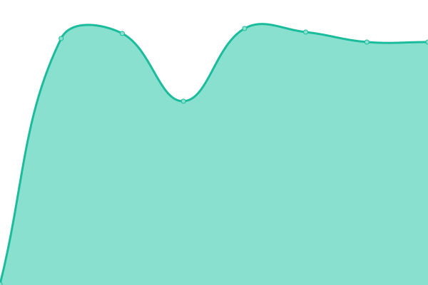
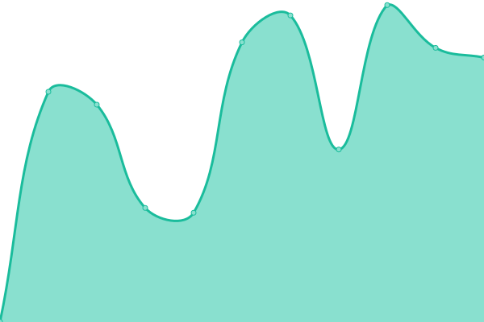

# [📈 Live Status](https://ArturiaPendragon.github.io/uptime-status): <!--live status--> **🟧 Partial outage**

This repository contains the open-source uptime monitor and status page for [Arturia Pendragon](https://ArturiaPendragon.github.io/uptime-status), powered by [Upptime](https://github.com/upptime/upptime).

With [Upptime](https://upptime.js.org), you can get your own unlimited and free uptime monitor and status page, powered entirely by a GitHub repository. We use [Issues](https://github.com/ArturiaPendragon/uptime-status/issues) as incident reports, [Actions](https://github.com/ArturiaPendragon/uptime-status/actions) as uptime monitors, and [Pages](https://ArturiaPendragon.github.io/uptime-status) for the status page.

<!--start: status pages-->
<!-- This summary is generated by Upptime (https://github.com/upptime/upptime) -->
<!-- Do not edit this manually, your changes will be overwritten -->
<!-- prettier-ignore -->
| URL | Status | History | Response Time | Uptime |
| --- | ------ | ------- | ------------- | ------ |
|  Datacenter - Helsinki (FI) | 🟩 Up | [datacenter-helsinki-fi.yml](https://github.com/ArturiaPendragon/uptime-status/commits/HEAD/history/datacenter-helsinki-fi.yml) | 

 161ms
     
 | 

<a href="https://ArturiaPendragon.github.io/uptime-status/history/datacenter-helsinki-fi">100.00%</a>
    

|  Flood Service - Helsinki (FI) | 🟩 Up | [flood-service-helsinki-fi.yml](https://github.com/ArturiaPendragon/uptime-status/commits/HEAD/history/flood-service-helsinki-fi.yml) | 

 326ms
     
 | 

<a href="https://ArturiaPendragon.github.io/uptime-status/history/flood-service-helsinki-fi">100.00%</a>
    

|  Datacenter - Paris (FR) | 🟩 Up | [datacenter-paris-fr.yml](https://github.com/ArturiaPendragon/uptime-status/commits/HEAD/history/datacenter-paris-fr.yml) | 

 138ms
     
 | 

<a href="https://ArturiaPendragon.github.io/uptime-status/history/datacenter-paris-fr">100.00%</a>
    

|  Ishtar Project - Paris (FR) | 🟩 Up | [ishtar-project-paris-fr.yml](https://github.com/ArturiaPendragon/uptime-status/commits/HEAD/history/ishtar-project-paris-fr.yml) | 

 138ms
     
 | 

<a href="https://ArturiaPendragon.github.io/uptime-status/history/ishtar-project-paris-fr">100.00%</a>
    

|  API - Spain (ES) | 🟩 Up | [api-spain-es.yml](https://github.com/ArturiaPendragon/uptime-status/commits/HEAD/history/api-spain-es.yml) | 

 94ms
     
 | 

<a href="https://ArturiaPendragon.github.io/uptime-status/history/api-spain-es">100.00%</a>
    

|  [Arturia Pendragon Website](https://www.ovh.com/fr/) | 🟥 Down | [arturia-pendragon-website.yml](https://github.com/ArturiaPendragon/uptime-status/commits/HEAD/history/arturia-pendragon-website.yml) | 

 898ms
     
 | 

<a href="https://ArturiaPendragon.github.io/uptime-status/history/arturia-pendragon-website">99.77%</a>
    

<!--end: status pages-->

[**Visit our status website →**](https://ArturiaPendragon.github.io/uptime-status)

## 📄 License

- Powered by: [Upptime](https://github.com/upptime/upptime)
- Code: [MIT](./LICENSE) © [Arturia Pendragon](https://ArturiaPendragon.github.io/uptime-status)
- Data in the `./history` directory: [Open Database License](https://opendatacommons.org/licenses/odbl/1-0/)
